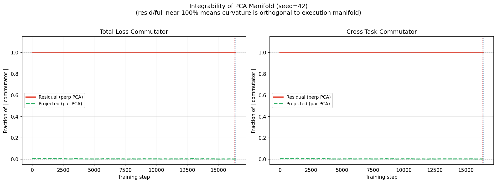
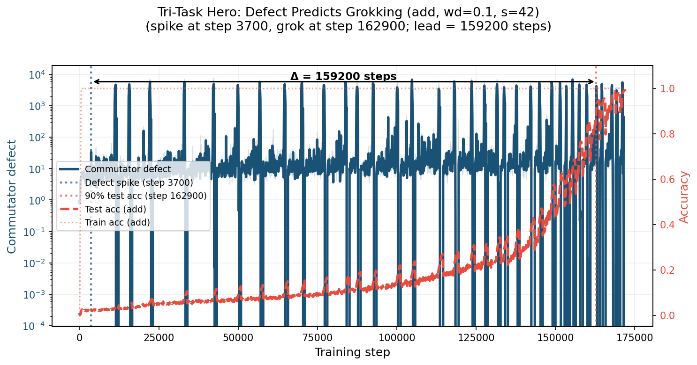

# The Geometry of Multi-Task Grokking: Transverse Instability, Superposition, and Weight Decay Phase Structure

We extend geometric analysis of grokking to multi-task modular arithmetic, training shared-trunk Transformers on dual-task (mod-add + mod-mul) and tri-task (mod-add + mod-mul + mod-sq) objectives across a systematic weight decay sweep (up to 90 runs). We combine trajectory PCA, commutator defect analysis, Hessian eigenspectra, weight-SVD spectral analysis, and causal gradient perturbations to characterize the geometry of multi-task generalization. We find that tasks grok in a fixed order with near-orthogonal heads; trajectories remain confined to an integrable low-dimensional manifold; weight decay acts as a phase parameter; solutions are holographically incompressible; weight matrix spectral gaps undergo a characteristic competition-and-collapse cycle that follows the staggered grokking order; and removing <10% of orthogonal gradient components eliminates grokking, revealing transverse fragility and redundant center manifolds in overparameterized models.

Code and figures for the paper:

> **The Geometry of Multi-Task Grokking: Transverse Instability, Superposition, and Weight Decay Phase Structure**
> Yongzhong Xu (2026)

## Key Findings

We train shared-trunk Transformers on dual-task (mod-add + mod-mul) and tri-task (mod-add + mod-mul + mod-sq) modular arithmetic across a systematic weight decay sweep (up to 90 runs), and discover eight consistent phenomena:

1. **Staggered grokking order** &mdash; Multiplication generalizes first, followed by squaring and then addition, with consistent delays across seeds.

2. **Universal integrability** &mdash; Optimization trajectories remain confined to a low-dimensional execution manifold with near-perfect integrability (&rho; &asymp; 1.000). Commutator defect onset reliably precedes generalization (42/42 conditions).

3. **Weight decay phase structure** &mdash; Grokking timescale, curvature depth, reconstruction threshold, and defect lead covary systematically with weight decay, revealing distinct dynamical regimes. Zero decay has curvature but no grokking.

4. **Holographic incompressibility** &mdash; Solutions occupy only 4&ndash;8 PCA directions yet are distributed across full-rank weights and destroyed by minimal perturbation. Neither SVD, pruning, nor &plusmn;5% scaling preserves performance.

5. **Transverse fragility and redundancy** &mdash; Removing <10% of orthogonal gradient components eliminates grokking. Dual-task models partially recover at extreme deletion (50%), suggesting redundant center manifolds; tri-task models do not.

6. **Spectral edge: mode competition and collapse** &mdash; Weight matrix SVD reveals a characteristic spectral cycle in multi-task grokking: the dominant singular value gap (&sigma;&#8321; &minus; &sigma;&#8322;) narrows as modes compete, reaches a minimum concurrent with the matrix commutator &#8214;[W_Q, W_K]&#8214;_F peak, then widens as one mode dominates. Each task's spectral collapse follows the staggered grokking order (mul &rarr; sq &rarr; add). Non-grokking (wd=0) controls lack this cycle entirely.

7. **Phase portrait geometry** &mdash; In (spectral gap, commutator) phase space, multi-task grokking traces the same characteristic loop as single-task: competition (near-degenerate modes) &rarr; instability (peak non-commutativity) &rarr; alignment (post-collapse, generalization). The loop structure is preserved across dual-task and tri-task models, and across the full weight decay sweep&mdash;higher weight decay produces tighter, faster loops.

8. **Per-head spectral decomposition** &mdash; Layerwise and per-head spectral cascade analysis reveals that each attention head undergoes its own mode-competition cycle, with heads specializing for different tasks showing staggered spectral transitions. Commutator heatmaps confirm that head-level non-commutativity peaks are task-specific and temporally ordered.

<p align="center">
  
  
</p>
<p align="center"><em>Left: Near-perfect integrability (&rho; &asymp; 1.000) in dual-task training. Right: Commutator defect onset precedes grokking across tri-task conditions.</em></p>

## Model

- **Architecture**: 2-layer Transformer encoder, pre-norm, d_model=128, 4 heads, d_ff=256, GELU, no dropout
- **Dual-task**: ~303k params, shared trunk + 2 heads for (x+y) mod 97 and (x&middot;y) mod 97
- **Tri-task**: ~315k params, shared trunk + 3 heads (adds x&sup2;+y&sup2; mod 97)
- **Optimizer**: AdamW, lr=1e-3, &beta;&#8322;=0.98, batch 512, grad clip 1.0
- **Weight decay sweep**: &lambda; &isin; {0.0, 0.1, 0.2, 0.3, 0.5, 1.0} &times; 3 seeds (42, 137, 2024)

## Repository Structure

```
multitask-grokking/
├── modadd_modmul/          # Dual-task experiments (mod-add + mod-mul)
│   ├── train_multitask.py          # Training script (all WD × seeds)
│   ├── pca_analysis.py             # Trajectory PCA and manifold analysis
│   ├── commutator_analysis.py      # Commutator defect and integrability
│   ├── hessian_analysis.py         # Hessian bottom eigenvalue estimation
│   ├── hessian_aggregate.py        # Multi-seed Hessian summary
│   ├── hessian_wd*.py              # Per-condition Hessian runs
│   ├── pca_threshold_scan.py       # Reconstruction threshold k* scan
│   ├── gradient_projection_ablation.py  # Orthogonal gradient deletion
│   ├── eigenvector_ablation*.py    # Eigenvector ablation variants
│   ├── postgrok_compression.py     # SVD/pruning/scaling compression tests
│   ├── snapshot_decomposition.py   # Temporal decomposition analysis
│   ├── spectral_analysis.py        # Weight SVD gaps, phase portraits, spectral edge verification
│   ├── spectral_plots/             # Spectral analysis figures
│   ├── defect_wd_comparison.py     # Cross-WD defect comparison
│   ├── fit_wd_groktime.py          # WD vs grok time analysis
│   └── plots/                      # 125 figures (figMT_*, figTHR_*, etc.)
│
├── tri_task/               # Tri-task experiments (+ mod-sq)
│   ├── train_tritask.py            # Training script
│   ├── train_wd02_03.py            # Additional WD conditions
│   ├── pca_analysis.py             # Trajectory PCA
│   ├── commutator_analysis.py      # Commutator defect
│   ├── hessian_analysis.py         # Hessian eigenvalues
│   ├── generalization_dynamics.py  # Defect-grokking lead time analysis
│   ├── pca_threshold_scan.py       # Reconstruction threshold k*
│   ├── ortho_fine_scan.py          # Fine-grained orthogonal deletion
│   ├── spectral_analysis.py        # Weight SVD gaps, phase portraits, spectral edge verification
│   ├── spectral_plots/             # Spectral analysis figures
│   └── plots/                      # 79 figures (figTT_*, figTRI_*, etc.)
│
├── spectral/                       # Gram matrix spectral analysis
│   └── thesis_table7_replication.py    # g₂₃, R, k* from Gram matrix (W=10)
│
├── layerwise_phase_portrait.py     # Per-layer/head spectral cascade analysis
├── commutator_heatmap.py           # Per-head/layer commutator heatmaps
├── layerwise_phase_portraits/      # Layer cascade plots (modadd + tritask)
├── commutator_heatmaps/            # Commutator heatmaps (modadd + tritask)
│
└── .gitignore              # Excludes .pt checkpoints (~20GB)
```

## Running the Experiments

### Prerequisites

```bash
pip install torch numpy matplotlib scipy tqdm
```

### 1. Train models

```bash
# Dual-task: trains all 18 conditions (6 WD × 3 seeds)
python modadd_modmul/train_multitask.py

# Tri-task: trains all 18 conditions
python tri_task/train_tritask.py
python tri_task/train_wd02_03.py  # WD=0.2, 0.3 conditions
```

Checkpoints are saved to `results/` subdirectories (~20GB total, excluded from git).

### 2. Analysis pipeline

Run in order after training completes:

```bash
# ── Dual-task analyses ──
python modadd_modmul/pca_analysis.py              # Trajectory PCA, eigenspectra
python modadd_modmul/commutator_analysis.py        # Commutator defect, integrability
python modadd_modmul/hessian_analysis.py           # Hessian bottom eigenvalue
python modadd_modmul/pca_threshold_scan.py         # Reconstruction threshold k*
python modadd_modmul/postgrok_compression.py       # Compression tests (SVD, pruning, scaling)
python modadd_modmul/gradient_projection_ablation.py  # Orthogonal gradient deletion
python modadd_modmul/spectral_analysis.py             # Weight SVD gaps & phase portraits

# ── Tri-task analyses ──
python tri_task/pca_analysis.py
python tri_task/commutator_analysis.py
python tri_task/hessian_analysis.py
python tri_task/pca_threshold_scan.py
python tri_task/generalization_dynamics.py         # Defect lead time analysis
python tri_task/ortho_fine_scan.py                 # Fine-grained deletion scan
python tri_task/spectral_analysis.py               # Weight SVD gaps & phase portraits

# ── Gram matrix spectral analysis ──
python spectral/thesis_table7_replication.py       # g₂₃, R, k* from Gram matrix

# ── Cross-task spectral analysis ──
python layerwise_phase_portrait.py                 # Per-layer/head spectral cascades
python commutator_heatmap.py                       # Per-head commutator heatmaps
```

All scripts produce figures in their respective `plots/` directories.

## Key Figures

| Figure | File | Description |
|--------|------|-------------|
| Training curves | `figMT_A_accuracy_s42.png` | Dual-task accuracy showing staggered grokking |
| Integrability | `figMT_K_integrability_s42.png` | &rho; &asymp; 1.000 across training |
| Defect traces | `figMT_J_defect_s42.png` | Commutator defect with orthogonal projection |
| Hessian phase | `figMT_H18_combined_dual.png` | Grok time vs curvature depth across WD |
| Compression | `figCOMP_A_compression.png` | SVD/pruning/scaling all fail |
| Threshold k* | `figTHR_B_threshold_vs_wd.png` | Reconstruction threshold vs weight decay |
| Defect predicts grokking | `figTT_W2_hero_defect_predicts_grok.png` | Defect onset leads grokking (tri-task) |
| Orthogonal deletion | `figORTHO_fine_dose_response.png` | Dose-response with 10% fragility cliff |
| Lead time | `figTT_X_defect_lead_time.png` | Defect lead time across WD |
| SVD timeseries | `spectral_plots/fig1_master_timeseries.png` | Weight SVD spectral gaps over training |
| Narrative test | `spectral_plots/fig2_narrative_test.png` | Spectral gap predicts grokking |
| Phase portrait | `spectral_plots/fig3_hero_phase_portrait.png` | Spectral gap vs commutator defect |
| Phase grid | `spectral_plots/fig4_grid_phase_portrait.png` | Grid of phase portraits across conditions |
| Grok vs control | `spectral_plots/fig5_grok_vs_control_portrait.png` | Spectral grok vs control comparison |
| SVD comparison | `spectral_plots/fig6_svd_grok_vs_control.png` | SVD-based grok vs control |
| WD sweep portraits | `spectral_plots/fig7_wd_sweep_portraits.png` | Phase portraits across weight decay |
| Layer cascades | `layerwise_phase_portraits/` | Per-layer spectral cascade plots |
| Commutator heatmaps | `commutator_heatmaps/` | Per-head/layer commutator heatmaps |
| Gram matrix g₂₃ | `spectral/coherence_edge_plots/` | Gram matrix eigenvalue gap decline (18/18 grokking, 1/18 control) |

## Gram Matrix Spectral Analysis

Replication of the intra-signal gap framework ([Xu 2026, arXiv:2603.28964](https://arxiv.org/abs/2603.28964)). Computes three quantities from the rolling-window Gram matrix (W=10) of flattened attention-weight updates across all single-task, dual-task, and tri-task runs:

| Quantity | Definition | WD > 0 (grokking) | WD = 0 (control) |
|----------|------------|-------------------|-------------------|
| g₂₃ | σ₂² − σ₃² of Gram matrix | Declines 8–111× before grokking (18/18) | No decline (1/18) |
| R | σ_{k\*}/σ_{k\*+1} gap ratio | 1.39 ± 0.08 | 2.51 ± 0.56 |
| k\* (weighted) | Signal rank | k\*=1 in 15/18 (83%) | Spread across 1–9 |

Script: `spectral/thesis_table7_replication.py`

## Companion Papers

- [Low-Dimensional Execution Manifolds in Transformer Learning Dynamics](https://arxiv.org/abs/2602.10496) &mdash; Single-task geometric analysis (arXiv:2602.10496)
- [Low-Dimensional and Transversely Curved Optimization Dynamics in Grokking](https://arxiv.org/abs/2602.16746) &mdash; Companion paper on integrability and curvature (arXiv:2602.16746)
- [Early-Warning Signals of Grokking via Loss-Landscape Geometry](https://arxiv.org/abs/2602.16967) &mdash; Extension to Dyck languages and SCAN benchmark (arXiv:2602.16967)

## Citation

```bibtex
@article{xu2026multitask,
  title={The Geometry of Multi-Task Grokking: Transverse Instability, Superposition, and Weight Decay Phase Structure},
  author={Xu, Yongzhong},
  journal={arXiv preprint},
  year={2026}
}
```

## License

MIT
